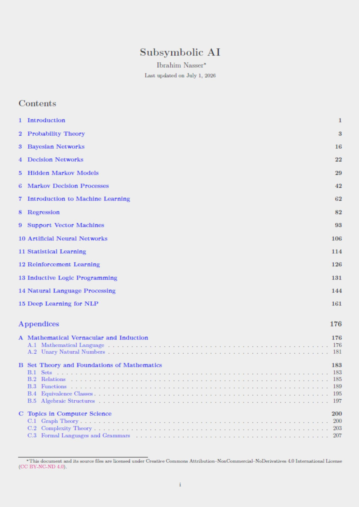

# Subsymbolic AI

  
  
  

  

> **Disclaimer:** Following on [Symbolic AI](https://github.com/96ibman/Symbolic-AI) for the AI 1 course, this is another summary as a personal learning and documentation effort for the AI 2 course.
It is not an official course document, and the material is provided as an auxiliary resource only.

## Topics Covered
- Probability Theory and Bayesian Networks
- Decision Networks
- HMMs and MDPs
- Intro, Decision Trees, and Computational Learning Theory
- Regression, SVMs, and ANNs
- Statistical Learning
- Reinforcement learning
- Inductive Logic
- NLP and Deep Learning for NLP

## Feedback & Contributions
This summary is a **living document**. I may continue to revise, extend, and improve it over time.
Spotted a mistake or have a suggestion? Feel free to open an issue or contact me.

## License
This document and its source files are licensed under Creative Commons Attribution--NonCommercial--NoDerivatives 4.0 International License ([CC BY-NC-ND 4.0](https://creativecommons.org/licenses/by-nc-nd/4.0/legalcode)).